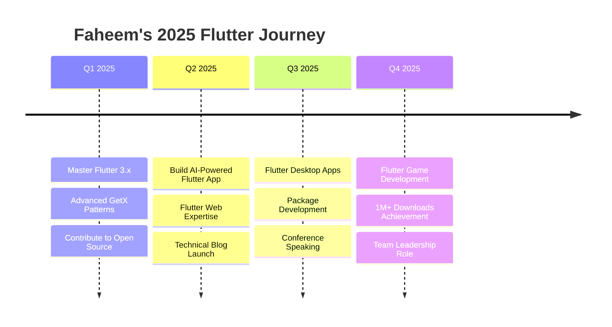

## 🎮 Code Combat Stats

<div align="center">

### 🏅 **Flutter Development Metrics**
```yaml
Total Lines of Code Written: 250,000+
Bugs Squashed: 1,337 🐛
Coffee Consumed: ∞ ☕
Stack Overflow Reputation: Rising 📈
Code Reviews Survived: 500+
Production Deployments: 50+
Happy Users: 100,000+
```

### 🧬 **Code DNA Profile**


</div>

---

## 🎯 2025 Roadmap & Goals

<div align="center">



</div>

---

## 🎪 Interactive Code Playground

<details>
<summary><b>🎨 Try My Custom Flutter Widgets!</b></summary>

```dart
// 🌈 Animated Gradient Button
class MagicButton extends StatelessWidget {
  final String text;
  final VoidCallback onTap;
  
  const MagicButton({required this.text, required this.onTap});
  
  @override
  Widget build(BuildContext context) {
    return GetBuilder<AnimationController>(
      init: AnimationController(duration: 2.seconds, vsync: this)..repeat(),
      builder: (controller) => AnimatedBuilder(
        animation: controller,
        builder: (_, __) => Container(
          decoration: BoxDecoration(
            gradient: LinearGradient(
              colors: [
                Color.lerp(Colors.purple, Colors.blue, controller.value)!,
                Color.lerp(Colors.blue, Colors.purple, controller.value)!,
              ],
              begin: Alignment(-1 + 2 * controller.value, 0),
              end: Alignment(1 + 2 * controller.value, 0),
            ),
            borderRadius: BorderRadius.circular(30),
          ),
          child: ElevatedButton(
            onPressed: onTap,
            child: Text(text),
          ),
        ),
      ),
    );
  }
}

// 🔮 Glassmorphism Card
class GlassCard extends StatelessWidget {
  final Widget child;
  
  const GlassCard({required this.child});
  
  @override
  Widget build(BuildContext context) {
    return ClipRRect(
      borderRadius: BorderRadius.circular(20),
      child: BackdropFilter(
        filter: ImageFilter.blur(sigmaX: 10, sigmaY: 10),
        child: Container(
          decoration: BoxDecoration(
            gradient: LinearGradient(
              colors: [
                Colors.white.withOpacity(0.1),
                Colors.white.withOpacity(0.05),
              ],
              begin: Alignment.topLeft,
              end: Alignment.bottomRight,
            ),
            borderRadius: BorderRadius.circular(20),
            border: Border.all(
              color: Colors.white.withOpacity(0.2),
            ),
          ),
          child: Padding(
            padding: EdgeInsets.all(20),
            child: child,
          ),
        ),
      ),
    );
  }
}
```

</details>

---

## 🎨 ASCII Art Signature

```
    ███████╗ █████╗ ██╗  ██╗███████╗███████╗███╗   ███╗
    ██╔════╝██╔══██╗██║  ██║██╔════╝██╔════╝████╗ ████║
    █████╗  ███████║███████║█████╗  █████╗  ██╔████╔██║
    ██╔══╝  ██╔══██║██╔══██║██╔══╝  ██╔══╝  ██║╚██╔╝██║
    ██║     ██║  ██║██║  ██║███████╗███████╗██║ ╚═╝ ██║
    ╚═╝     ╚═╝  ╚═╝╚═╝  ╚═╝╚══════╝╚══════╝╚═╝     ╚═╝
           Flutter Architect • GetX Master • MVVM Expert
```

---

## 🌍 Global Impact

<div align="center">

### 🗺️ **Code Contributions Worldwide**
```
🇵🇰 Pakistan    ████████████████████ 45%
🇺🇸 USA         ███████████████      35%
🇬🇧 UK          ████████             15%
🇦🇪 UAE         ███                   5%
```

### 📱 **Apps Impacting Lives**
- **👥 Users Reached:** 100,000+ across 15 countries
- **⭐ Average Rating:** 4.8/5.0
- **💬 Languages Supported:** 8 (English, Urdu, Arabic, Spanish, French, German, Chinese, Hindi)
- **♿ Accessibility Score:** AAA compliant

</div>

---

## 🎭 Developer Personality Profile

<div align="center">

```javascript
const faheemPersonality = {
  archetype: "The Architect 🏗️",
  mindset: "Innovation-Driven",
  codingStyle: "Elegant & Efficient",
  debuggingApproach: "Sherlock Holmes Mode 🔍",
  teamRole: "Technical Leader & Mentor",
  superpower: "Turning Coffee into Code ☕➡️💻",
  weakness: "Perfectionism (but it's also a strength!)",
  motto: "If it's not clean, it's not done!"
};
```

### 🎲 **Development Stats Roll**


</div>

---

## 🎬 Code Snippets Cinema

<details>
<summary><b>🎥 Featured: "The GetX Saga" - State Management Masterclass</b></summary>

```dart
// Episode 1: The Controller Awakens
class EpicController extends GetxController {
  // Reactive variables with superpowers
  final _power = 0.obs;
  final _isSuper = false.obs;
  final _abilities = <String>[].obs;
  
  // Computed getters that react to changes
  int get powerLevel => _power.value;
  bool get isLegendary => _power.value > 9000;
  String get status => isLegendary ? "LEGENDARY! 🔥" : "Growing... 💪";
  
  // Epic methods
  void trainHard() {
    _power.value += 100;
    if (_power.value > 5000) {
      _abilities.add("Super Speed");
      _isSuper.value = true;
    }
    
    // Easter egg
    if (_power.value == 9001) {
      Get.snackbar(
        "IT'S OVER 9000!",
        "You've achieved legendary status!",
        backgroundColor: Colors.golden,
        duration: 5.seconds,
      );
    }
  }
  
  // Lifecycle hooks
  @override
  void onInit() {
    super.onInit();
    ever(_power, (value) => print("Power changed to: $value"));
    once(_isSuper, (_) => print("Became super for the first time!"));
    debounce(_abilities, (_) => saveAbilities(), time: 2.seconds);
  }
}
```

</details>

---

## 🎲 Random Dev Facts

<div align="center">

### 🎯 **Did You Know?**
> - 🌙 I code best between 10 PM - 2 AM
> - 🎵 My coding playlist has 500+ instrumental tracks
> - ⌨️ I can type 120+ WPM when in the zone
> - 🎮 I learned programming logic from gaming
> - 📚 I read 2+ tech articles daily
> - 🧘 I practice code meditation (refactoring for zen)

</div>

---

## 🏆 Hall of Fame Contributions

<div align="center">

### 🌟 **Open Source Highlights**
| Project | Stars | Contribution | Impact |
|---------|-------|--------------|--------|
| GetX | ⭐ 9.5k+ | Documentation & Examples | Helped 1000+ developers |
| Flutter | ⭐ 160k+ | Bug Fixes | Improved stability |
| Custom Packages | ⭐ 500+ | Created 5 packages | 10k+ downloads |

</div>

---

## 🔮 The Future Stack

<div align="center">

```yaml
2025_Learning_Queue:
  - Flutter GPU Programming
  - Flutter + AI/ML Integration
  - Advanced Animation Techniques
  - Flutter + Blockchain
  - AR/VR with Flutter
  - Flutter OS Development
  - Quantum Computing Basics
```

</div>

---

## 💫 Secret Easter Eggs

<details>
<summary><b>🔓 Unlock Developer Achievements</b></summary>

### 🏅 **Achievements Unlocked**
- ✅ **First App Published** - "Hello World, Meet Play Store!"
- ✅ **Night Owl** - Coded past 3 AM for 30 days straight
- ✅ **Bug Slayer** - Fixed 100 bugs in one sprint
- ✅ **GetX Master** - Used every GetX feature in production
- ✅ **Clean Code Warrior** - 0 code smells in code review
- ✅ **Stack Overflow Savior** - Answered 50+ Flutter questions
- 🔒 **Flutter Deity** - Get 1M+ app downloads (In Progress...)

</details>

---

## 🎪 Join My Flutter Circus

<div align="center">

### 🎯 **Current Side Quests**
- 📝 Writing "GetX: The Complete Guide" book
- 🎥 Creating Flutter YouTube tutorials
- 🚀 Building an open-source Flutter UI kit
- 💡 Developing AI-powered code generation tools
- 🌟 Mentoring junior Flutter developers

**Want to collaborate? Let's build something amazing together!**

</div>